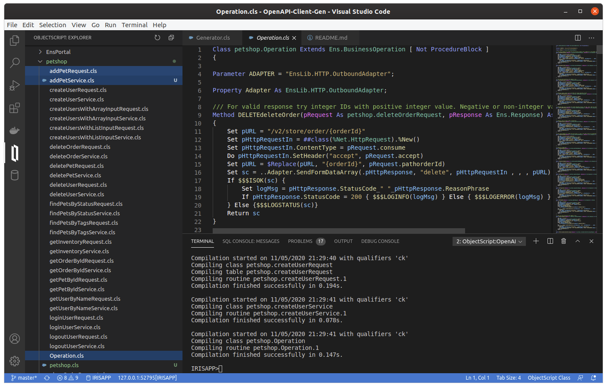
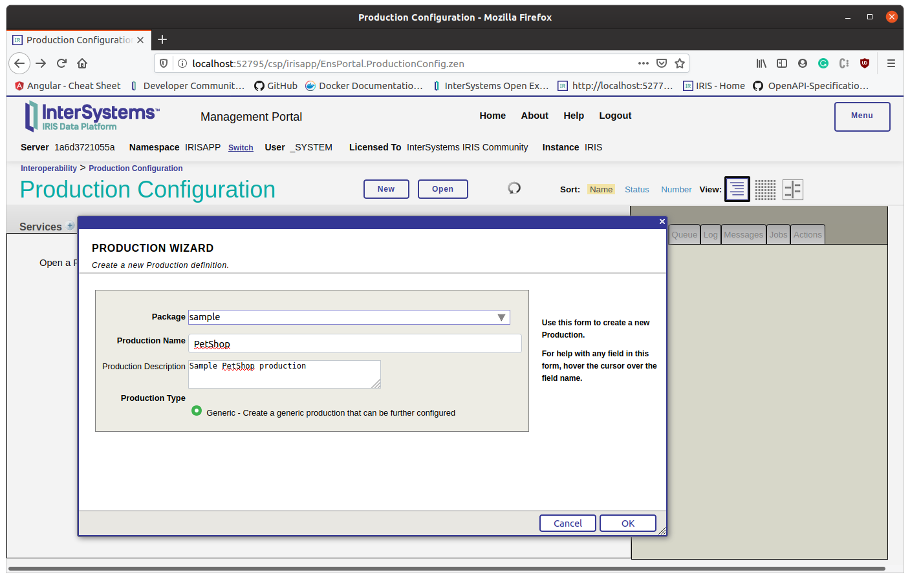
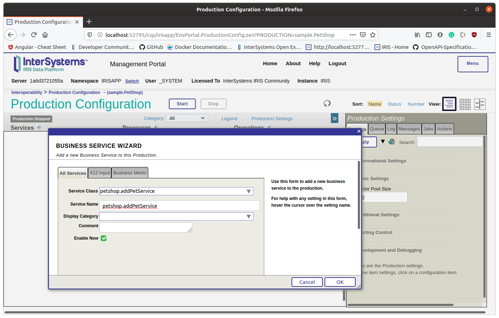
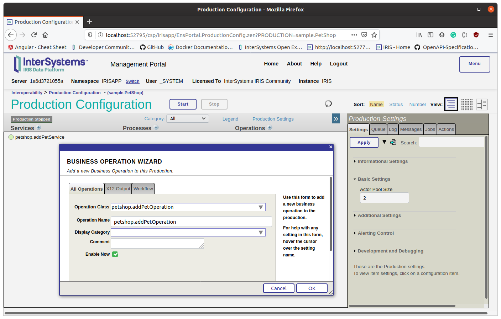
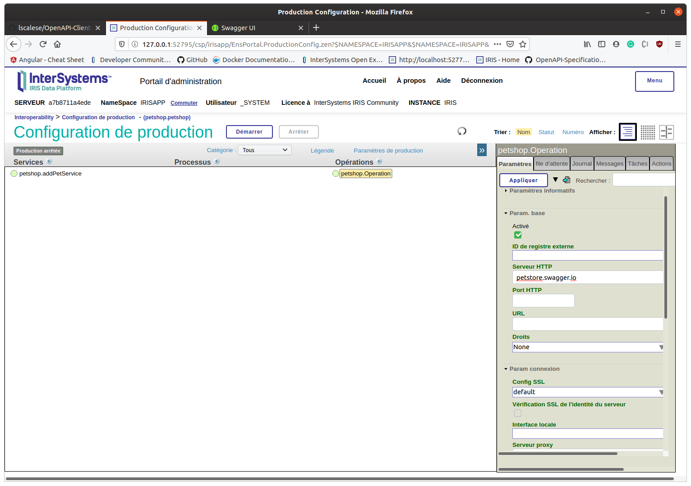

## OPENAPI Client Gen

This is an application to generate Iris interoperability classes from a Swagger 2.0 specification document.  
It can be used as tool to create classes on your local instance or to be hosted.  
If this application is hosted on a server, a REST api is available to upload the specification document and download the generated classes.  
  
  
## Production Sample

This sample generate interoperability classes for [petshop Swagger 2.0 API](https://petstore.swagger.io/) and then  
use the `/pet Add a new pet to the store` with a simple [InboudAdapter](https://github.com/lscalese/OpenAPI-Client-Gen/blob/master/src/dc/openapi/client/samples/InboundAdapter.cls) which is used by a generated Business Service to create an instance of a generated EnsRequest class.  
 
After that we link the service to a generated BusinessOperation to perform an http request.  

### Generate interoperatibility classes

Let's start by generate interoperability classes from [petshop Swagger 2.0 document](https://petstore.swagger.io/).  

```
Zn "irisapp"
Set sc = ##class(dc.openapi.client.Spec).generateApp("petshop", "https://petstore.swagger.io:443/v2/swagger.json")
Write !,"Status : ",$SYSTEM.Status.GetOneErrorText(sc)
```
The first argument is the package name where the classes will be generate and the seconde is the Swagger 2.0 specification URL.  
Also the [method](https://github.com/lscalese/OpenAPI-Client-Gen/blob/master/src/dc/openapi/client/Spec.cls#L11) accept a filename or dynamic object.  

Export classes addPetOperation, addPetRequest, addPetService to your projet



Take a look on these generated class:  
* petshop.addPetService is a BusinessService template class which should be edited with your need.  
* petshop.addPetRequest class represent is a subclass of EnsRequest and there is a property for each parameter defined in the swagger specification.  
* petshop.addPetOperation is the BusinessOperation generated class. It contain the generated to code to fill a %Net.HttpRequest object from the EnsRequest object.  This is the most interesting code generation in this project.  

### Prepare the BusinessService class

Edit the petshop.addPetService class to use our [dc.openapi.client.samples.InboundAdapter](https://github.com/lscalese/OpenAPI-Client-Gen/blob/master/src/dc/openapi/client/samples/InboundAdapter.cls#L1) ready for our sample.  

Replace : 
```
/// Auto generated : Change by your Adapter type.
Parameter ADAPTER = "Ens.Adapter";

/// Auto generated : Change by your Adapter type.
Property Adapter As Ens.Adapter;

```

By:
```
Parameter ADAPTER = "dc.openapi.client.samples.InboundAdapter";

Property Adapter As dc.openapi.client.samples.InboundAdapter;
```

After that, we implement the OnProcessInput method.  
```
Method OnProcessInput(pInput As dc.openapi.client.samples.InputPet, pOutput As %RegisteredObject) As %Status
{
	Set msg = ##class(petshop.addPetRequest).%New()
	Set msg.accept = "application/json"
	Set msg.consume = "application/json"
	Set body = {
		"category": {
			"id": (pInput.categoryId),
			"name": (pInput.categoryName)
		},
		"name": (pInput.petName),
		"photoUrls": [
			"https://blog.nordnet.com/wp-content/uploads/2018/08/lolcat-working-problem.png"
		],
		"tags": [
			{
			"id": 0,
			"name": "string"
			}
		],
		"status": "available"
	}
	Do msg.bodybody.Write(body.%ToJSON()) ; To implement
	Return ..SendRequestAsync("petshop.addPetOperation", msg)
}
```

### Configure a production

Open the [production page](http://localhost:52795/csp/irisapp/EnsPortal.ProductionConfig.zen) and create a new production.  


After that add to your production addPetService and addPetOperation.  




Configure the Business Operation with the http server and a SSL Config:  



Apply and start the production.  

Great!  Our production is ready.  
Let's create data.

### Create Pet

To generate input data, call this method in a terminal:

```
Do ##class(dc.openapi.client.samples.PetShop).addPet()
```

## Prerequisites
Make sure you have [git](https://git-scm.com/book/en/v2/Getting-Started-Installing-Git) and [Docker desktop](https://www.docker.com/products/docker-desktop) installed.

## Installation: ZPM

Open IRIS Namespace with Interoperability Enabled.
Open Terminal and call:
USER>zpm "install openapi-client-gen"

## Installation: Docker
Clone/git pull the repo into any local directory

```
$ git clone https://github.com/lscalese/OpenAPI-Client-Gen.git
```

Open the terminal in this directory and run:

```
$ docker-compose build
```

3. Run the IRIS container with your project:

```
$ docker-compose up -d
```
